# Widgets v2 — the gallery

Every image is a committed render-test reference: what CI pins is what
this page shows. Home faces render on the real sky ground; accessory
faces render as the luminance forms the vibrant material keeps
(white-on-dark stand-in), with two pinned over a deliberately busy
ground — the photo-wallpaper worst case. Accented (tinted/clear)
renders show the pre-tint hierarchy the system receives: primary
figures and ornaments in the accent group, grounds cleared.

On-device verification items (true tinted mode, StandBy night shift,
real wallpaper) are listed in `POLISH_FINDINGS.md`.

## Home screen

| Widget | State | Render |
|---|---|---|
| Small · Next Prayer | afternoon | 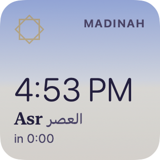 |
| Small · Next Prayer | night | 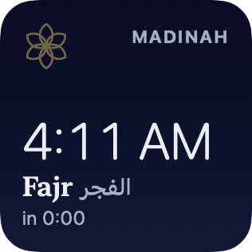 |
| Small · Next Prayer | accented (tinted/clear) | 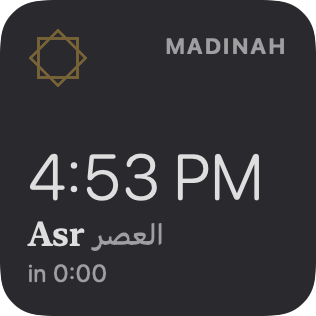 |
| Small · Hijri Day | afternoon, white day | 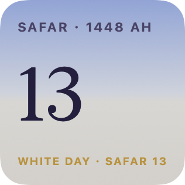 |
| Small · Hijri Day | accented | 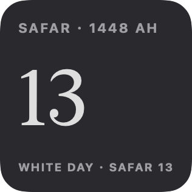 |
| Small · any | invitation (no/stale data) |  |
| Medium · Day Strip | afternoon | 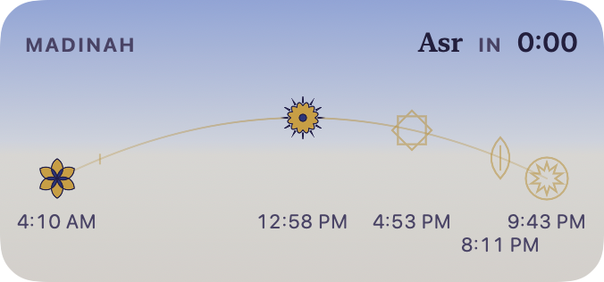 |
| Medium · Day Strip | night | 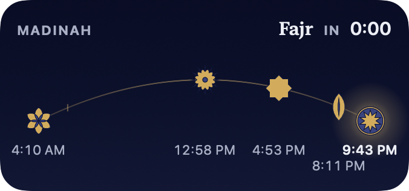 |
| Medium · Day Strip | Ramadan (iftar inscription) | 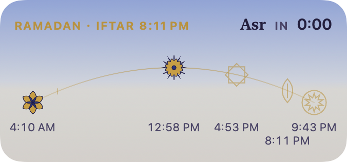 |
| Medium · Day Strip | excused pause (neutral marks) |  |
| Medium · Day Strip | accented | 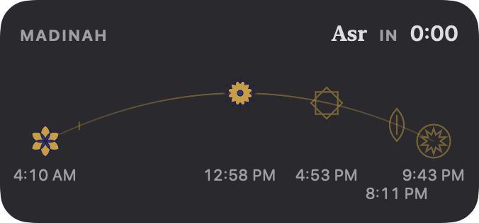 |
| Large · The Plate | afternoon (sun over the arc) | 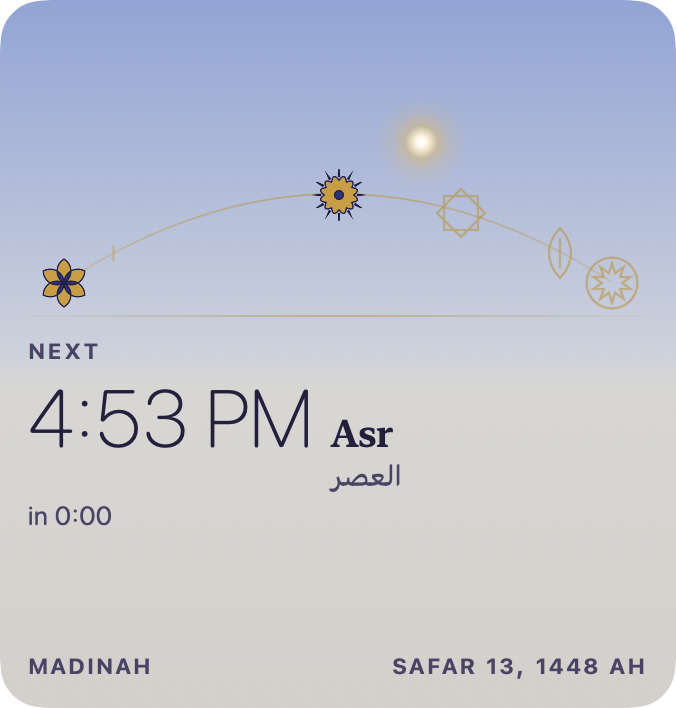 |
| Large · The Plate | night (true moon phase) | 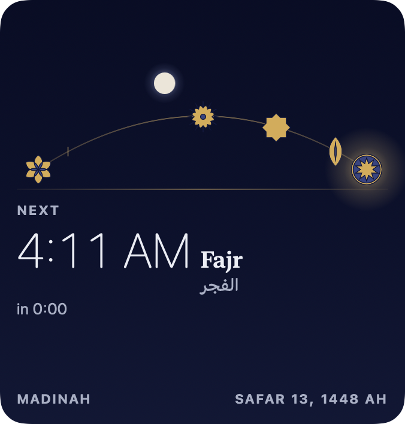 |
| Large · The Plate | Ramadan | 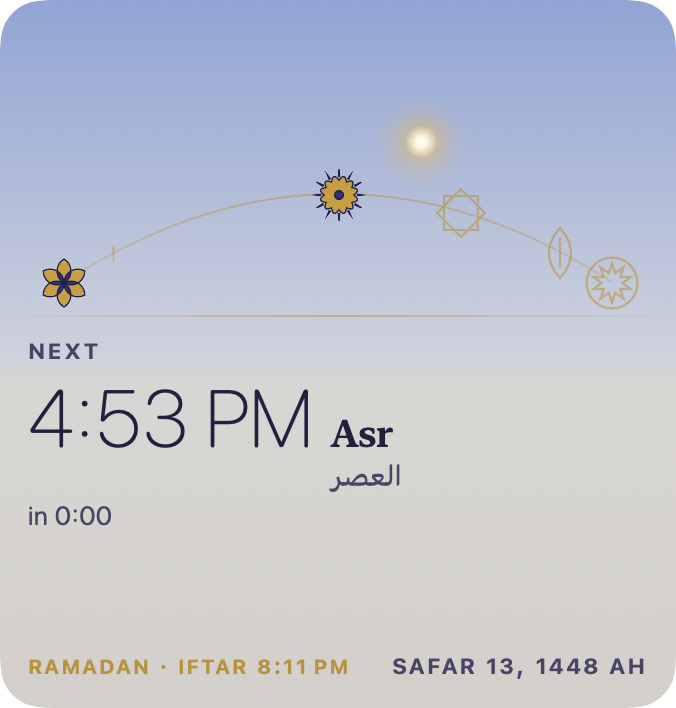 |
| Large · The Plate | accented | 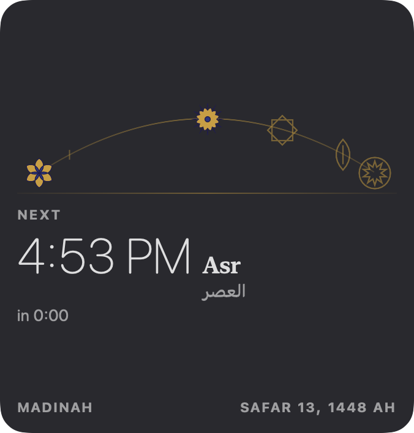 |
| Nightstand strip (StandBy) | night ink |  |

## Lock screen accessories

| Accessory | State | Render |
|---|---|---|
| Circular · Next Prayer | vibrant |  |
| Circular · Next Prayer | busy wallpaper |  |
| Circular · Window Gauge | forenoon gap (empty ring) |  |
| Rectangular · Now & Next | vibrant |  |
| Rectangular · Day Row | vibrant | 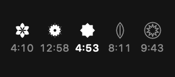 |
| Rectangular · Day Row | busy wallpaper | 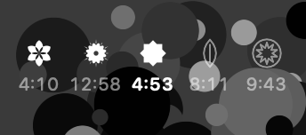 |
| Rectangular · Night | last third, now |  |
| Rectangular · Night | before nisf al-layl |  |
| Rectangular · Night | daytime preview |  |
| Rectangular · Fasting | Ramadan afternoon |  |

## Shared plate component

| Component | State | Render |
|---|---|---|
| CompactPlate | medium, afternoon |  |
| CompactPlate | medium, night | 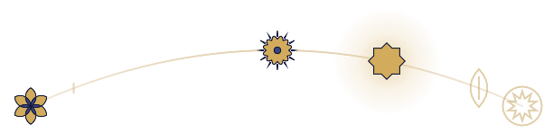 |
| CompactPlate | large row, afternoon |  |
